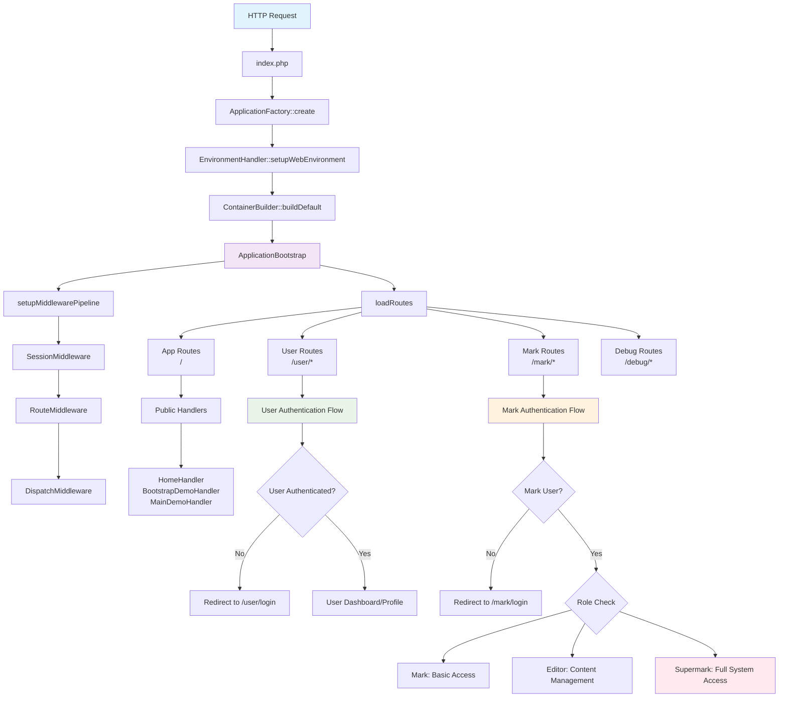
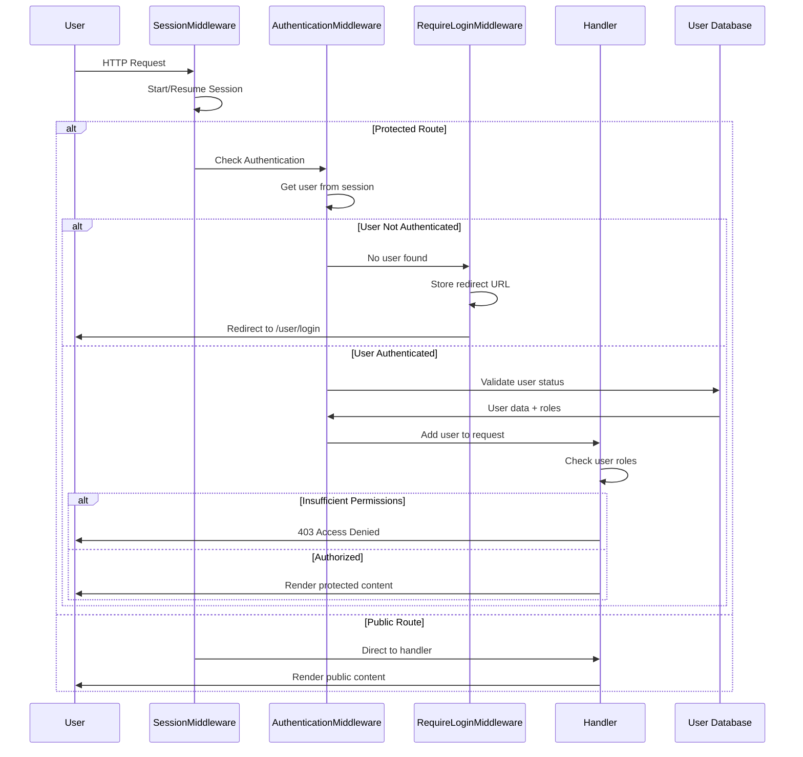
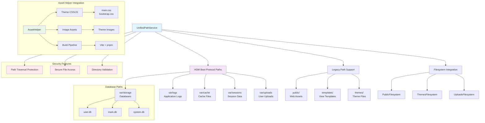

# HDM Boot Protocol - Application Flow Diagrams

Táto dokumentácia obsahuje Mermaid diagramy zobrazujúce architektúru a flow aplikácie založenej na HDM Boot Protocol.

## 1. Celkový Application Flow



### Kľúčové komponenty:

- **ApplicationFactory**: Hlavný vstupný bod pre vytvorenie aplikácie
- **ApplicationBootstrap**: Centralizovaná inicializácia middleware a routes
- **Middleware Pipeline**: SessionMiddleware → RouteMiddleware → DispatchMiddleware
- **Route Loading**: Modulárne načítanie routes pre app, user, mark a debug

## 2. User Authentication & Authorization Flow



### User Module Features:

- **Session Management**: Automatické spravovanie sessions
- **Role-based Access**: guest → user → admin hierarchy
- **Redirect Handling**: Uloženie pôvodnej URL pre redirect po prihlásení
- **Database Integration**: user.db s users, user_sessions, user_permissions

## 3. Mark Module Authentication & Role Hierarchy

```mermaid
graph TD
    A[Mark Route Request] --> B[MarkAuthenticationMiddleware]
    B --> C{Session exists?}
    C -->|No| D[Redirect to /mark/login]
    C -->|Yes| E{mark_user_id in session?}
    E -->|No| D
    E -->|Yes| F[Load MarkUser from mark.db]
    
    F --> G{User exists & active?}
    G -->|No| H[Clear session & redirect]
    G -->|Yes| I{Is Mark User?}
    I -->|No| H
    I -->|Yes| J[Add mark_user to request]
    
    J --> K{Route requires Supermark?}
    K -->|Yes| L[SupermarkAuthorizationMiddleware]
    K -->|No| M[Continue to Handler]
    
    L --> N{User is Supermark?}
    N -->|No| O[403 Access Denied]
    N -->|Yes| M
    
    M --> P[Mark Handler]
    
    subgraph "Mark Role Hierarchy"
        Q[Supermark<br/>Full System Access]
        R[Editor<br/>Content Management]
        S[Mark<br/>Basic Access]
        
        Q -.-> R
        Q -.-> S
        R -.-> S
    end
    
    subgraph "Supermark-Only Routes"
        T[/mark/database]
        U[/mark/settings]
        V[/mark/backups]
        W[/mark/users/delete]
    end
    
    subgraph "All Mark Users"
        X[/mark/dashboard]
        Y[/mark/health]
        Z[/mark/logs]
        AA[/mark/cache]
    end
    
    style Q fill:#ffebee
    style R fill:#fff3e0
    style S fill:#e8f5e8
    style T fill:#ffebee
    style U fill:#ffebee
    style V fill:#ffebee
    style W fill:#ffebee
```

### Mark Module Features:

- **Dual Authentication**: Samostatná autentifikácia pre mark users
- **Role Hierarchy**: mark → editor → supermark s dedičnosťou permissions
- **Security Layers**: MarkAuthenticationMiddleware + SupermarkAuthorizationMiddleware
- **Separate Database**: mark.db izolovaná od user.db pre bezpečnosť

## 4. Database Architecture

```mermaid
erDiagram
    USER_DB {
        users ||--o{ user_sessions : has
        users ||--o{ user_permissions : has
        
        users {
            int id PK
            string username UK
            string email UK
            string password_hash
            text roles
            boolean is_active
            datetime created_at
            datetime last_login_at
            datetime updated_at
        }
        
        user_sessions {
            string id PK
            int user_id FK
            string ip_address
            string user_agent
            int last_activity
            datetime created_at
        }
        
        user_permissions {
            int id PK
            int user_id FK
            string permission
            datetime granted_at
        }
    }
    
    MARK_DB {
        mark_users ||--o{ mark_sessions : has
        mark_users ||--o{ mark_logs : creates
        
        mark_users {
            int id PK
            string username UK
            string email UK
            string password_hash
            text roles
            boolean is_active
            boolean is_supermark
            datetime created_at
            datetime last_login_at
        }
        
        mark_sessions {
            string id PK
            int mark_user_id FK
            string ip_address
            string user_agent
            int last_activity
            datetime created_at
        }
        
        mark_logs {
            int id PK
            int mark_user_id FK
            string action
            text details
            datetime created_at
        }
    }
    
    SYSTEM_DB {
        system_settings {
            int id PK
            string key UK
            text value
            string type
            datetime updated_at
        }
        
        system_cache {
            string key PK
            text value
            int expires_at
            datetime created_at
        }
        
        system_backups {
            int id PK
            string filename
            string type
            int size
            datetime created_at
        }
    }
```

### Database Design:

- **user.db**: Štandardní používatelia s rolami guest/user/admin
- **mark.db**: Mark users s rolami mark/editor/supermark + audit log
- **system.db**: Systémové nastavenia, cache a backupy
- **SQLite**: Lightweight, file-based databázy v var/storage/

## 5. HDM Path Service & Asset Management



### Path Service Features:

- **Unified Interface**: Kombinuje HDM Boot Protocol + legacy path support
- **Security**: Path traversal protection a validácia
- **Asset Management**: Integrácia s AssetHelper pre themes a build pipeline
- **Filesystem Abstraction**: League Flysystem pre bezpečný file access

## Použitie

Tieto diagramy môžete použiť pre:

1. **Onboarding**: Rýchle pochopenie architektúry pre nových vývojárov
2. **Dokumentácia**: Vizuálne vysvetlenie komplexných flows
3. **Debugging**: Identifikácia problémov v authentication/authorization
4. **Planning**: Rozšírenie funkcionalít s pochopením existujúcej štruktúry

## Aktualizácia

Diagramy aktualizujte pri zmenách v:
- Route konfigurácii
- Middleware pipeline
- Authentication/authorization logike
- Database schéme
- Path service implementácii
